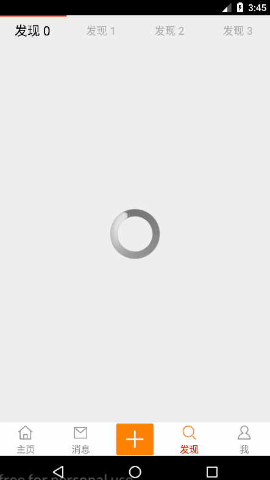
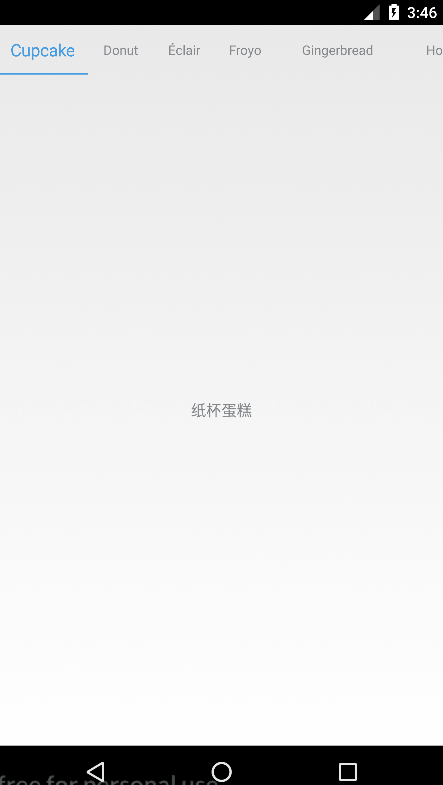

# navigation
底部导航navigation和tab选项卡，结合viewpager，fragment懒加载使用，轮播、引导页、可滑动tab等 

[参考ViewPagerIndicator](https://github.com/LuckyJayce/ViewPagerIndicator)

### 一、navigation



```
代码示例：
   <com.bingo.multitab.view.viewpager.SViewPager
        android:id="@+id/tab_main_viewPager"
        android:layout_width="match_parent"
        android:layout_height="0dp"
        android:layout_weight="1"
        android:background="#eee" />

    <com.bingo.multitab.view.indicator.FixedIndicatorView
        android:id="@+id/tab_main_indicator"
        android:layout_width="match_parent"
        android:layout_height="50dp"
        android:background="#fff" />
        
/*onCreate()中初始化组件*/        
 SViewPager viewPager = (SViewPager) findViewById(R.id.tab_main_viewPager);
        indicator = (FixedIndicatorView) findViewById(R.id.tab_main_indicator);
        indicator.setOnTransitionListener(new OnTransitionTextListener().setColor(Color.RED, Color.GRAY));
        //这里可以添加一个view，作为centerView，会位于Indicator的tab的中间
        centerView = getLayoutInflater().inflate(R.layout.tab_main_center, indicator, false);
        indicator.setCenterView(centerView);
        //可以设置事件
        //centerView.setOnClickListener(onClickListener);

        indicatorViewPager = new IndicatorViewPager(indicator, viewPager);
        indicatorViewPager.setAdapter(new MyAdapter(getSupportFragmentManager()));
        // 禁止viewpager的滑动事件（不可左右滑动）
        viewPager.setCanScroll(false);
        // 设置viewpager保留界面不重新加载的页面数量
        viewPager.setOffscreenPageLimit(4);
        //设置当前选中的位置（不包括上面添加的centerView）
        indicatorViewPager.setCurrentItem(2,true);
        
   /*相关适配器和方法，建议拿出去单独写*/          
  	参考BottomNavAdapter        
```

### 二、可滑动的tab+ViewPager




* 布局

  ~~~
     <com.bingo.multitab.view.indicator.ScrollIndicatorView
          android:id="@+id/moretab_indicator"
          android:layout_width="match_parent"
          android:layout_height="45dp" />
  
      <android.support.v4.view.ViewPager
          android:id="@+id/moretab_viewPager"
          android:layout_width="match_parent"
          android:layout_height="match_parent" />
  ~~~

  

* 代码

  ```
   ViewPager viewPager = (ViewPager) findViewById(R.id.moretab_viewPager);
          ScrollIndicatorView scrollIndicatorView = (ScrollIndicatorView) findViewById(R.id.moretab_indicator);
  
          float unSelectSize = 12;
          float selectSize = unSelectSize * 1.3f;
          scrollIndicatorView.setOnTransitionListener(new OnTransitionTextListener().setColor(0xFF2196F3, Color.GRAY).setSize(selectSize, unSelectSize));
  
          scrollIndicatorView.setScrollBar(new ColorBar(this, 0xFF2196F3, 4));
  
          viewPager.setOffscreenPageLimit(2);
          indicatorViewPager = new IndicatorViewPager(scrollIndicatorView, viewPager);
          indicatorViewPager.setAdapter(new MyAdapter());
  /*adapter*/        
  private class MyAdapter extends IndicatorViewPager.IndicatorViewPagerAdapter {
          private String[] versions = {"Cupcake", "Donut", "Éclair", "Froyo", "Gingerbread", "Honeycomb", "Ice Cream Sandwich", "Jelly Bean", "KitKat", "Lolipop", "Marshmallow"};
          private String[] names = {"纸杯蛋糕", "甜甜圈", "闪电泡芙", "冻酸奶", "姜饼", "蜂巢", "冰激凌三明治", "果冻豆", "奇巧巧克力棒", "棒棒糖", "棉花糖"};
  
          @Override
          public int getCount() {
              return versions.length;
          }
          @Override
          public View getViewForTab(int position, View convertView, ViewGroup container) {
              if (convertView == null) {
                  convertView = getLayoutInflater().inflate(R.layout.tab_top, container, false);
              }
              TextView textView = (TextView) convertView;
              textView.setText(versions[position]);
  
              int witdh = getTextWidth(textView);
              int padding = DisplayUtil.dipToPix(getApplicationContext(), 8);
              //因为wrap的布局 字体大小变化会导致textView大小变化产生抖动，这里通过设置textView宽度就避免抖动现象
              //1.3f是根据上面字体大小变化的倍数1.3f设置
              textView.setWidth((int) (witdh * 1.3f) + padding);
  
              return convertView;
          }
  
          @Override
          public View getViewForPage(int position, View convertView, ViewGroup container) {
              if (convertView == null) {
                  convertView = new TextView(container.getContext());
              }
              TextView textView = (TextView) convertView;
              textView.setText(names[position]);
              textView.setGravity(Gravity.CENTER);
              textView.setTextColor(Color.GRAY);
              return convertView;
          }
  
          @Override
          public int getItemPosition(Object object) {
              //这是ViewPager适配器的特点,有两个值 POSITION_NONE，POSITION_UNCHANGED，默认就是POSITION_UNCHANGED,
              // 表示数据没变化不用更新.notifyDataChange的时候重新调用getViewForPage
              return PagerAdapter.POSITION_UNCHANGED;
          }
  
          private int getTextWidth(TextView textView) {
              if (textView == null) {
                  return 0;
              }
              Rect bounds = new Rect();
              String text = textView.getText().toString();
              Paint paint = textView.getPaint();
              paint.getTextBounds(text, 0, text.length(), bounds);
              int width = bounds.left + bounds.width();
              return width;
          }
      }        
          
  ```

  